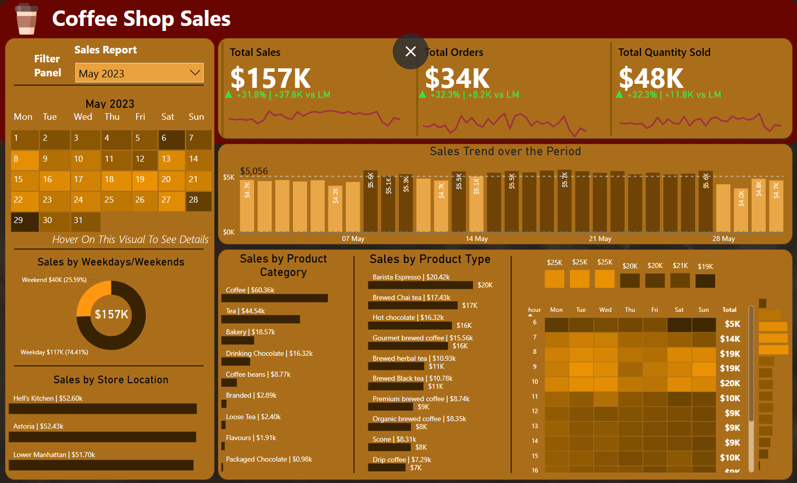

# Coffee Shop Sales Analysis

https://github.com/user-attachments/assets/bff0e838-fb37-401e-8b3a-729a305a07b7

## Overview

This project analyzes coffee shop sales data to uncover insights into sales trends, customer behavior, and product performance. The analysis involves extracting, aggregating, and visualizing data to identify key patterns and actionable insights. I used MySQL to write queries that structured and aggregated the data, which was then imported into Power BI for visualization. This project highlights essential KPIs such as sales growth, top-selling products, customer purchasing patterns, and overall sales performance across different time periods.

---

---

---

## Tools I Used

### 1. MySQL
I used MySQL to query the data from the coffee shop sales dataset. The queries I wrote focused on key business metrics such as total sales, quantity sold, number of orders, and performance over different time periods (days, weeks, months). These queries were then turned into views, which I imported into Power BI for analysis.

Some of the queries I wrote include:
- **Monthly Sales**: Analyzing total sales and tracking month-over-month (MoM) growth.
- **Monthly Orders and Quantity Sold**: Understanding the total number of orders and quantity sold each month.
- **Sales by Time**: Grouping sales by weekdays, weekends, and hours of the day to identify peak sales periods.
- **Product Sales**: Analyzing the performance of different products, identifying top sellers, and ranking them by sales.

### 2. Power BI
After importing the data into Power BI via the MySQL server load data option, I created a date table and established connections between the tables in the model view. This allowed me to create multiple visuals to represent the data effectively. I also created several DAX measures, such as total sales, total orders, and total quantity sold, to aggregate data for specific visualizations. Additionally, I used DAX to calculate the month-over-month increase rate (MoM) and applied conditional formatting to certain visuals based on sales performance (e.g., color coding based on total sales for each day, hour, or week).

---

## Key Insights

- **February Sales Decline**: In February, the month-over-month (MoM) growth rate was -6.8%, indicating a slight loss compared to January.
- **Highest Sales in May**: May had the highest sales, with a MoM increase of 31.8%. Sales reached $157k, with 34k orders and 48k units sold.
- **January's Lowest Performance**: January had the lowest sales, with $82k in revenue, 17k orders, and 25k units sold.
- **Weekday Sales Dominance**: Almost 70% of sales across all months occurred on weekdays, indicating that weekdays drive the majority of revenue.
- **Top Products**: Coffee, tea, and bakery items consistently ranked as the top three product categories across all months.
- **Top-Selling Products**: Barista Espresso and Barista Chai Tea were the top-selling products every month, leading the sales consistently.

---

## Conclusion

This analysis provides valuable insights that can help optimize sales strategies and improve customer engagement. By tracking monthly trends and performing in-depth analysis on product sales and ordering patterns, stakeholders can make informed decisions that directly impact revenue growth and customer satisfaction.

---

